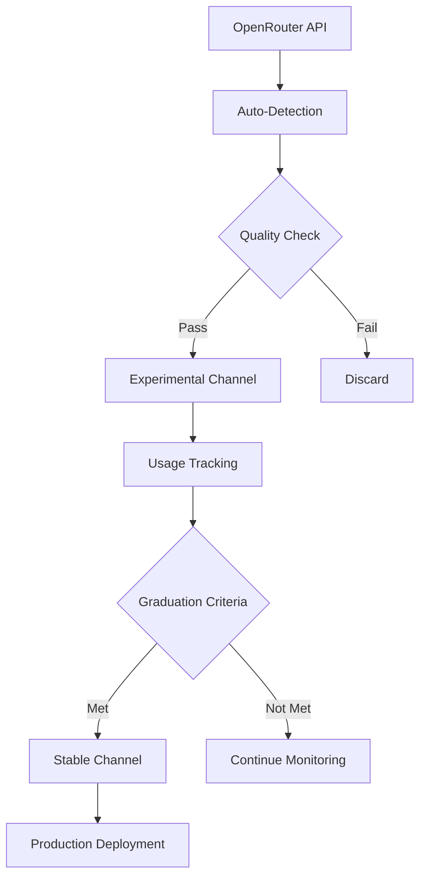

# AI Models Infrastructure

This directory contains the complete AI model selection and evaluation infrastructure for the Zen MCP Server, including dynamic routing, complexity analysis, and multi-channel model management.

## Overview

The Zen MCP Server provides a comprehensive AI model management platform with two integrated systems:

### 1. **Core Dynamic Routing System** 
Intelligent model routing across multiple LLM platforms, enabling requests by model type rather than specific model names (e.g., "best free coding model", "executive-level reasoning model"). The system automatically selects optimal models based on:

- **Complexity Analysis**: Automatic prompt complexity assessment using `routing/complexity_analyzer.py`
- **Cost Optimization**: Intelligent cost-performance balancing via `routing/model_level_router.py`
- **User Tier Management**: Model access control based on organizational levels
- **Performance Intelligence**: Benchmark-driven model selection

### 2. **PromptCraft Integration System**
Extended API endpoints and multi-channel model curation for external applications:

- **API Gateway**: RESTful endpoints for route analysis and smart execution  
- **Two-Tier Channels**: Stable (verified) + Experimental (bleeding-edge) model tracks
- **Automated Curation**: New model detection, benchmarking, and graduation pipeline
- **Performance Analytics**: Real-time model performance tracking and optimization

## Architecture Components

### Core Dynamic Routing (`routing/`)

- **`model_level_router.py`** - Primary model selection engine with complexity-based routing
- **`complexity_analyzer.py`** - Prompt analysis and task classification system
- **`model_routing_config.json`** - Model level definitions and routing rules
- **`monitoring.py`** - Performance tracking and metrics collection

### Model Data Management (`docs/models/`)

- **`models.csv`** - Master stable model database (24+ verified models)
- **`bands_config.json`** - Quantitative scoring bands and organizational requirements
- **`models_schema.json`** - JSON validation schema for model data structure

### PromptCraft Extension System (`plugins/promptcraft_system/`)

- **`experimental_models.json`** - Bleeding-edge models awaiting verification
- **`graduation_queue.json`** - Models undergoing promotion evaluation
- **`channel_manager.py`** - Stable/experimental channel orchestration
- **`api_server.py`** - RESTful API endpoints for external integration

### Generated Views (Auto-updated)

- **`current-models.md`** - Current model analysis and rankings
- **`automated_evaluation_criteria.py`** - Model evaluation automation

## Centralized Band System Architecture

The model selection system uses a **centralized band configuration approach** where all model categorizations are controlled from a single source of truth (`bands_config.json`). This enables automatic model reassignment when criteria change.

### 🎯 **9 Centralized Band Categories**

#### 1. **Context Window Bands** (`context_window_bands`)
Automatically categorize models by context capacity:
- **Compact**: ≤65K tokens (6-8 models)
- **Standard**: 65K-200K tokens (8-10 models) 
- **Extended**: 200K-999K tokens (5-7 models)
- **Large**: 1M+ tokens (3-4 models)

#### 2. **Cost Tier Bands** (`cost_tier_bands`)
Automatically categorize models by pricing:
- **Free**: $0.00 (8 models, 32%)
- **Economy**: $0.01-$1.00 per million tokens (4-5 models)
- **Value**: $1.01-$10.00 per million tokens (6 models, 24%)
- **Premium**: $10.01+ per million tokens (6 models, 24%)

#### 3. **Performance Bands** (`performance_bands`)
Automatically categorize models by HumanEval scores:
- **Basic**: ≤65.0 (3-4 models)
- **Good**: 65.1-75.0 (6-8 models)
- **Excellent**: 75.1-85.0 (8-10 models)
- **Exceptional**: 85.1+ (4-6 models)

#### 4. **Tier Classification Bands** (`tier_classification_bands`)
Automatically assign strategic tiers based on combined criteria:
- **Free Champion**: Free + ≥60 HumanEval (8 models)
- **Value Tier**: ≤$2 cost + ≥70 HumanEval (6 models)
- **High Performance**: ≤$10 cost + ≥75 HumanEval (6 models)
- **Premium**: ≥$3 cost + ≥80 HumanEval (5 models)

#### 5. **Org Level Assignment Bands** (`org_level_assignment_bands`)
Automatically assign models to organizational levels:
- **Junior**: ≤$1 cost + ≥60 HumanEval + ≥32K context (8 models)
- **Senior**: ≤$10 cost + ≥70 HumanEval + ≥65K context (10 models)
- **Executive**: Unlimited cost + ≥80 HumanEval + ≥128K context (7 models)

#### 6. **Provider Trust Bands** (`provider_trust_bands`)
Automatically classify providers by trust score:
- **Tier 1 Trusted**: Score 9+ (OpenAI, Anthropic, Google)
- **Tier 2 Verified**: Score 8+ (Microsoft, Meta, Mistral)
- **Tier 3 Emerging**: Score 7+ (DeepSeek, Qwen, Perplexity)
- **Tier 4 Experimental**: Score 5+ (HuggingFace, others)

#### 7. **Role Assignment Bands** (`role_assignment_bands`)
Automatically assign professional roles based on specialization and performance:
- **Technical Roles**: Coding/debugging specialists → senior_developer, code_reviewer, qa_engineer
- **Architecture Roles**: Premium models ≥80 HumanEval → lead_architect, system_architect, technical_director
- **Analysis Roles**: Reasoning/security specialists → security_analyst, risk_analyst, research_lead
- **Validation Roles**: Free/economy models → technical_validator, security_checker

#### 8. **Rank Assignment Bands** (`rank_assignment_bands`)
Automatically assign model rankings based on quantitative criteria:
- **Tier 1 Flagship** (Ranks 1-5): Premium models from major providers ≥85 HumanEval
- **Tier 2 Professional** (Ranks 6-15): High-performance models ≥75 HumanEval
- **Tier 3 Efficient** (Ranks 16-25): Cost-effective models ≥65 HumanEval
- **Tier 4 Specialized** (Ranks 26-35): Experimental/specialized models ≥50 HumanEval

#### 9. **Strength Classification Bands** (`strength_classification_bands`)
Automatically assign strength descriptions based on performance characteristics:
- **Next Generation**: Flagship premium models ≥88 HumanEval from major providers
- **Advanced**: Professional-grade models ≥85 HumanEval with ≤$25 cost
- **Balanced**: Well-rounded models ≥75 HumanEval with good context
- **Efficient**: Cost-optimized models (top efficiency tercile)
- **Specialized**: Domain-specific models (vision, coding, debugging)
- **Experimental**: Emerging technology models

### 🔄 **Single Source of Truth Benefits**

#### Automatic Cascading Updates
```json
// Change context window definition in ONE place:
"large": {"min_tokens": 1000000}  // ← Only change needed

// Result: All models automatically reassign to new bands
// No manual CSV updates required
```

#### Dynamic Model Assignment
```python
# When bands_config.json changes:
selector = DynamicModelSelector()  # Auto-detects changes
band_changes = selector.detect_and_apply_band_changes()
# → Models automatically move to appropriate bands
# → CSV files automatically updated
# → Cache updated to track changes
```

#### Consistent Cross-Tool Usage
All model selection tools use the same band definitions:
- Context window selection: Uses `context_window_bands`
- Cost optimization: Uses `cost_tier_bands`  
- Role assignment: Uses `role_assignment_bands`
- Performance targeting: Uses `performance_bands`

### 📊 **Centralized Configuration Example**

When you update band definitions in `bands_config.json`, changes automatically cascade:

#### Before: Change Context Window Threshold
```json
{
  "context_window_bands": {
    "large": {"min_tokens": 500000}  // Old threshold
  }
}
```

#### After: Update Definition
```json  
{
  "context_window_bands": {
    "large": {"min_tokens": 1000000}  // New threshold - ONLY change needed
  }
}
```

#### Automatic Result:
- Models 500K-999K: Move from `large` → `extended` band
- Models 1M+: Remain in `large` band  
- CSV files automatically updated
- All tools immediately use new bands

### 🎯 **Configuration-Driven Architecture**

The entire model classification system is now **configuration-driven** rather than hard-coded:

| Category | Configuration File | Automatic Assignment |
|----------|-------------------|---------------------|
| **Context Windows** | `context_window_bands` | Based on token count |
| **Cost Tiers** | `cost_tier_bands` | Based on pricing |
| **Performance** | `performance_bands` | Based on HumanEval scores |
| **Roles** | `role_assignment_bands` | Based on specialization + performance |
| **Rankings** | `rank_assignment_bands` | Based on multi-criteria scoring |
| **Strengths** | `strength_classification_bands` | Based on combined characteristics |
| **Org Levels** | `org_level_assignment_bands` | Based on cost + performance + context |
| **Provider Trust** | `provider_trust_bands` | Based on trust scores |
| **Tier Classification** | `tier_classification_bands` | Based on cost + performance criteria |

## Model Categories

### Free Models (11 models)
High-quality models with $0 cost, perfect for development and cost-conscious production:

- **Free Champions**: Llama 405B:free, DeepSeek R1:free, Qwen Coder:free
- **Specialized Free**: Phi-4 (debugging), Qwen VL (vision), QwQ (reasoning)

### Coding Specialists
Models optimized for software development tasks:

- **Qwen3 Coder** - Leading coding-focused model
- **Qwen 2.5 Coder:free** - Free coding specialist
- **DeepSeek R1** - Advanced reasoning for complex coding problems

### Vision Models
Models with multimodal capabilities:

- **Qwen 2.5 VL:free** - Free vision-language model
- **Gemini 2.5 Pro** - Premium vision capabilities

## OpenRouter Integration

All models include direct OpenRouter URLs for:
- Real-time pricing verification
- Model documentation access
- API endpoint configuration
- Performance benchmarking data

### Free Model Logic

OpenRouter uses `:free` suffix to indicate free versions of paid models:
- `model-name` = Paid version
- `model-name:free` = Free version with usage limits

## Benchmark Scores

Models include performance metrics:

- **HumanEval Score**: Coding capability (0-100%)
- **SWE-bench Score**: Software engineering tasks (0-100%)

## Usage Examples

### Find Best Free Coding Model (Automatic Band Assignment)
```python
from tools.custom.dynamic_model_selector import DynamicModelSelector

selector = DynamicModelSelector()
model = selector.find_models(
    specialization="coding",
    org_level="junior",  # Automatically uses cost_tier_bands: free/economy
    max_results=1
)[0]
# Returns: qwen/qwen-2.5-coder-32b-instruct:free
# Role automatically assigned via role_assignment_bands: technical_roles
```

### Get Executive-Level Reasoning Model (Automatic Band Assignment)
```python
model = selector.find_models(
    specialization="reasoning", 
    org_level="executive",  # Automatically uses org_level_assignment_bands criteria
    max_results=1
)[0]
# Returns: openai/gpt-5 or anthropic/claude-opus-4.1
# Rank automatically assigned via rank_assignment_bands: tier1_flagship
# Strength automatically assigned via strength_classification_bands: next_generation
```

### Centralized Band Usage
```python
# All these selections use centralized band definitions:

# Context window selection (uses context_window_bands)
large_models = selector.get_large_context_models()

# Cost optimization (uses cost_tier_bands) 
economy_models = selector.find_models(cost_tier="economy")

# Performance targeting (uses performance_bands)
excellent_models = selector.find_models(performance_band="excellent")

# Role-based selection (uses role_assignment_bands)
architect_models = selector.find_models(role="lead_architect")
```

### Dynamic Band Reassignment
```python
# Detect and apply band changes automatically
selector = DynamicModelSelector()

# Check for context window band changes
context_changes = selector.detect_and_apply_band_changes()

# Check for cost tier band changes  
cost_changes = selector.detect_and_apply_cost_tier_changes()

# New: Check for role assignment changes
role_assignments = selector.reassign_models_to_role_bands()

# New: Check for rank assignment changes
rank_assignments = selector.reassign_models_to_rank_bands()

# New: Check for strength classification changes
strength_assignments = selector.reassign_models_to_strength_bands()

if any([context_changes, cost_changes]):
    print("Models automatically reassigned to new bands!")
```

## Data Validation

All model data is validated against `models_schema.json`:

- Required fields enforcement
- Type validation (integers, floats, enums)
- Value range validation (costs, context windows)
- URL format validation for OpenRouter links
- Date format validation for updates

## Automated Updates

The system supports automated model evaluation for new releases:

1. **Discovery**: Monitor OpenRouter for new models
2. **Evaluation**: Run benchmark tests on new models
3. **Classification**: Assign tier, org_level, and specialization
4. **Integration**: Update CSV and regenerate views

## Contributing

When adding new models:

1. Add entry to `models.csv` with all required fields
2. Validate against `models_schema.json`
3. Run model selector to regenerate view files
4. Update OpenRouter URLs to current model pages
5. Include benchmark scores when available

## Cost Management

The band system provides multiple cost optimization strategies:

- **Free-first**: Prioritize free models for development
- **Value-conscious**: Balance cost and performance 
- **Performance-first**: Select best models regardless of cost
- **Organizational**: Match model costs to user authority levels

This infrastructure enables sophisticated model selection while maintaining cost control and performance optimization across the entire development lifecycle.

## Model Selection Framework

### Model Allocation Structure (Total: 25 models)

**Price Tier Distribution:**
```
Free Tier: 8 models (32%) - Higher redundancy due to availability issues
Value Tier: 6 models (24%) - Balanced cost/performance 
Premium Tier: 6 models (24%) - High-performance for critical tasks
Specialized: 5 models (20%) - Niche capabilities (coding, reasoning, multimodal)
```

**Organizational Level Distribution:**
```
Junior Level: 8 models (primarily free + some value)
Senior Level: 10 models (value + premium balance)  
Executive Level: 7 models (premium + top specialized)
```

**Capability Matrix Requirements:**
```
General Purpose: 8 models (32%) - Broad task handling
Coding Specialists: 6 models (24%) - Development tasks
Reasoning Experts: 5 models (20%) - Complex analysis
Multimodal: 3 models (12%) - Vision + text
Conversation: 3 models (12%) - Chat optimization
```

### Quantitative Selection Criteria

**Primary Metrics (70% weight):**
1. **Performance Benchmarks (30%)** - HumanEval, SWE-Bench, MMLU, HellaSwag scores
2. **Cost Efficiency (25%)** - Input/output cost per million tokens and performance-to-cost ratio
3. **Technical Specifications (15%)** - Context window, processing speed, reliability metrics

**Secondary Metrics (30% weight):**
1. **Strategic Value (15%)** - Provider diversity, unique capabilities, roadmap commitment
2. **Operational Factors (15%)** - API availability, rate limits, regional availability

### Model Replacement Decision Matrix

**Automatic Replacement Triggers:**
A new model should replace an existing model if it meets **ALL** criteria:
1. **Performance Superiority**: ≥10% improvement in primary benchmarks OR ≥5% improvement with ≥20% cost reduction
2. **Capability Coverage**: Maintains or improves existing capability coverage without gaps
3. **Strategic Alignment**: Fits price tier limits, maintains provider diversity, aligns with org levels

**Replacement Priority Scoring Formula:**
```
Replacement Score = (Performance_Improvement * 0.4) + 
                   (Cost_Efficiency_Gain * 0.3) + 
                   (Strategic_Value * 0.2) + 
                   (Operational_Benefits * 0.1)

Threshold for Replacement: Score ≥ 7.5/10
```

## Model Evaluation Example: GPT-5 Assessment

### Scenario: Evaluating GPT-5 Replacement

**Input Metrics:**
- HumanEval: 90.0, SWE-Bench: 80.0, MMLU: 88.5
- Cost: $5/M input, $15/M output  
- Context: 400K tokens, Multimodal: Yes

**Replacement Analysis vs Claude Opus 4:**
```python
score_breakdown = {
    "performance": 7.8,     # +5.6% HumanEval, +2.8% MMLU improvement
    "cost_efficiency": 9.2, # 80% cost reduction ($75 → $15 output)  
    "strategic_value": 8.1, # Larger context (400K vs 200K)
    "operational_benefit": 6.5 # Slight availability improvement
}

weighted_score = 8.05/10  # Exceeds 7.5 threshold
```

**Result:** ✅ **REPLACEMENT RECOMMENDED**

**Implementation Plan:**
1. **Phase 1:** Testing & validation (Week 1)
2. **Phase 2:** Gradual rollout with monitoring (Week 2)  
3. **Phase 3:** Full deployment with stability monitoring (Week 3)

**Expected Impact:**
- **Cost Savings:** ~$60/M tokens reduction
- **Performance:** 5.6% improvement in coding benchmarks
- **Context:** 2x larger context window (200K → 400K)

### Centralized Band Configuration Example

**Context Window Band Update:**
```json
// Single change in bands_config.json:
"context_window_bands": {
  "large": {"min_tokens": 1000000}  // Only this changed
}
```

**Automatic Result:**
- Models 200K-999K auto-move to "extended" band
- Only true 1M+ models remain in "large" band
- All tools immediately use new categorization

This demonstrates the power of centralized configuration - one change cascades throughout the entire model management system.

## Dynamic Routing System Details

### Complexity Analysis Pipeline

The routing system uses sophisticated prompt analysis to determine optimal model selection:

```python
# routing/complexity_analyzer.py workflow:
1. Extract prompt features (length, keywords, patterns)
2. Classify task type (coding, reasoning, general, analysis) 
3. Calculate complexity score (0.0-1.0)
4. Determine minimum model tier requirements
5. Generate routing recommendations
```

### Model Level Router

The `ModelLevelRouter` provides intelligent model selection with multiple strategies:

**Selection Strategies:**
- **Cost-Optimized**: Prioritize free models, fallback to paid
- **Performance-First**: Select highest-capability models
- **Balanced**: Optimize for cost-performance ratio
- **User-Tier**: Respect organizational access levels

**Integration Points:**
```python
from routing.model_level_router import ModelLevelRouter
from routing.complexity_analyzer import ComplexityAnalyzer

# Automatic routing workflow
router = ModelLevelRouter()
analyzer = ComplexityAnalyzer()

# Analyze prompt complexity
analysis = analyzer.analyze(prompt_text)

# Select optimal model
selected_model = router.select_model(
    complexity=analysis.complexity_score,
    task_type=analysis.task_type,
    user_tier="free",  # or "premium", "enterprise"
    cost_optimization=True
)
```

## PromptCraft Integration Architecture

### Two-Channel System

**Stable Channel** (`models.csv`)
- Verified models with proven performance
- Comprehensive benchmark scores
- Production-ready reliability
- Used by default for all applications

**Experimental Channel** (`experimental_models.json`)
- Bleeding-edge models from OpenRouter
- Automated discovery every 6 hours
- Basic quality filtering
- Advanced users and testing environments

### Automated Model Lifecycle



### API Gateway Endpoints

**Core Integration Points:**
- `POST /api/promptcraft/route/analyze` - Complexity analysis and recommendations
- `POST /api/promptcraft/execute/smart` - Route and execute in single call
- `GET /api/promptcraft/models/available` - Channel-aware model discovery

**Channel Management:**
- Automatic experimental model detection
- Performance-based graduation pipeline
- Real-time model availability tracking

### Performance Intelligence

The system maintains comprehensive performance metrics:

**Model Performance Tracking:**
- Response times and success rates
- Cost analysis per model and task type
- User satisfaction and preference data
- Benchmark score verification

**Optimization Algorithms:**
- Dynamic model ranking based on live performance
- Cost-efficiency optimization
- Load balancing across similar-tier models
- Predictive model availability management

## Implementation Status & Strategic Analysis

### ✅ Successfully Implemented Core Infrastructure
1. **Complete CSV data infrastructure** - `models.csv` with 24+ models across organizational tiers
2. **Sophisticated caching system** - Class-level caching with file modification time tracking
3. **Comprehensive fallback strategies** - Multi-tier fallback recovery system ensures resilience  
4. **Organizational role mapping** - Table-driven selection based on org levels (junior/senior/executive)
5. **Quantitative band configuration** - Working `bands_config.json` for context windows and cost tiers
6. **Schema validation** - JSON schema validation for data integrity
7. **Production model data** - GPT-5, Claude Opus 4.1, Gemini 2.5 Pro, and free tier models included

### Strategic Improvement Priorities

**Enterprise-Grade Reliability:**
- Comprehensive exception handling for file operations and data corruption
- Robust input validation for model configuration data
- Enhanced graceful degradation when critical files are unavailable

**Production Testing & Validation:**
- Unit test coverage for all core selection algorithms
- Integration testing for CSV parsing, model assignment, fallback strategies
- Performance regression testing for selection algorithm optimization

**Operational Automation:**
- Automated validation when new models are added
- OpenRouter API integration for new model discovery
- Weekly evaluation pipeline for new model analysis
- Real-time metrics collection for model selection decisions

### Strategic Implementation Roadmap

**Phase 1: Critical Infrastructure** ✅ **COMPLETED**
- Production models.csv with 24+ models
- Robust CSV parsing with fallbacks
- Quantitative scoring bands configured
- JSON schema validation implemented

**Phase 2: Enterprise Testing & Reliability** (Immediate Priority)
- Comprehensive unit test suite for all core selection methods
- Integration testing for CSV parsing, model assignment, fallback strategies  
- Enhanced error handling for file operations and data corruption scenarios
- Performance monitoring with detailed logging and metrics collection

**Phase 3: Operational Automation** (Short-term)
- OpenRouter API integration for automated model discovery
- Weekly evaluation pipeline for new model analysis and benchmarking
- Automated validation when new models are added to CSV
- Multi-view CSV generation for specialized use cases

### Success Metrics
- **✅ Model selection functionality** - Sub-100ms response with production caching system
- **✅ Robust fallback strategies** - Multi-tier emergency fallback system implemented
- **✅ Production model coverage** - 24+ models across all organizational tiers
- **Target**: 95%+ test coverage for production readiness
- **Target**: Zero manual intervention for new model integration
- **Target**: 20%+ cost savings through intelligent selection algorithms